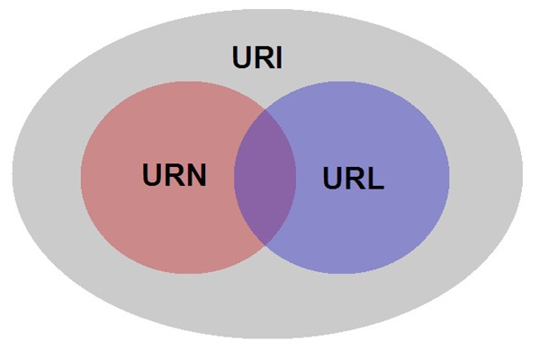

# 2. 曲径通幽：@Path

>  清晨入古寺，初日照高林。曲径通幽处，禅房花木深。山光悦鸟性，潭影空人心。万籁此都寂，但余钟磬音。——《题破山寺后禅院》

* 项目地址：<https://github.com/silentbalanceyh/vertx-zero-example/>（子项目：**up-apollo**）

##  「壹」关于URI

### 1.1. URI/URL/URN

　　最初认识RESTful，读者对URI/URL/URN三个概念不是很清楚，这里简单对比一下，首先读者必须清楚一件事情：**URL和URN都是URI的子集**，换言之URL和URN都是URI，但反过来说就不成立，它们的结构如下：


>  图片地址：<https://www.cnblogs.com/taoist123/p/11196971.html>

　　**URI**的全称是`Uniform Resource Identifier`，它是“统一资源标识符”，在整个互联网上所有的访问地址都抽象成了**资源**，这些资源拥有唯一的标识符，我们通过该标识符来访问资源，这个标识符就是URI。而URI在表述资源时分离了两个子类，一个就是我们常听到URL，而另外一个就是URN。

　　**URL**和**URI**名字相近，它的全称是`Uniform Resource Location`，意思是：“统一资源定位符”，我们通常可以通过URL来准确定义一个资源的位置，如：`http://localhost:6083/user/1`。它主要包含几部分：

* http：协议名称，在RESTful中常用的是`http/https`协议，而互联网上还可以使用`ftp`、`stmp`等各种协议。
* localhost：主机的域名，这个域名可以是IP地址，如：`10.0.0.100`这种格式。
* 6083：端口好，如果互联网上的URL不带端口号，就使用默认端口：`80`，如：`http://localhost/user/1`，这种格式使用`80`端口。
* 后边的`/user/1`就是当前访问资源的名称，它精确定位了所访问资源的路径。

>  有一点需要注意，在RESTful中通常会使用类似：`/user/:id` 来定义一个Api，它使用不同的参数来读取不同用户信息，这种情况下：`/user/1` 和 `/user/2` 表示两个URI，而不是一个，而您后端的程序逻辑可能定义的是一个。

　　**URN**，最后谈谈URN，它的全称是`Uniform Resource Name`，意思是：“统一资源名”，那么它有什么作用呢？实际上URN比URL更方便去定位资源，它只需要知道一个域名就可以了，直接隔离了资源本身所在的位置。换句话说，如果你把资源从`host1`切换到`host2`，这种情况下使用URL的话是需要变更访问地址的，如果是直接使用URN，那么名称不变就可以不用做任何操作，程序依旧会访问URN背后映射的真实资源地址。URN的通用语法如下：

```shell
< URN > ::= "urn:" < NID > ":" < NSS >
```

　　其中**UID**是命名空间标识符，**NSS**则是标识名空间的特定字符串，可以当做唯一名称。

### 1.2. 重复？

　　既然**URI**表示一个资源的唯一标识，那么在开发过程中难免会遇到**重复**的情况，在真实场景中，这种重复规则会给开发人员带来一定的诊断难度。

| 定义 | Curl访问 |
|---|:---|
| /user/get | GET /user/get |
| /user/:id | GET /user/1 |

　　上述两个例子实际上就出现了**重复性冲突**，当你发送第一个请求时，容器无法判断这里的`get`是表示一个固定路径，还是表示：`id = get`的路径。

| 定义 | Curl访问 |
|---|:---|
| /user/get | POST /user/get |
| /user/:id | GET /user/1 |

　　而上述两个例子则不会出现**重复**，原因在于它们所使用的**HTTP方法**不同，简单说在URI的描述中，还有一个维度容易被开发人员忽略，就是**HTTP方法**，同一个路径下方法不同，那么该URI也属于不同的资源标识符。　　

>  开发过程中，开发人员一定要注意URI的重复问题，重复的URI会导致请求出现不可预知的**二义性**情况，而真正避免重复性URI的方式不是开发，而是设计。

<hr/>

##  「贰」@Path

　　了解了基本概念后，那么接下来看看在`Zero`中如何定义一个RESTful的**URI**，Zero本身支持了**JSR311**的规范，所以在定义**URI**时直接使用JSR311中的表述方式来定义结构中的**URI**地址，主要使用注解：`javax.ws.rs.Path`。

　　`javax.ws.rs.Path`注解在JSR311中可以使用在两个地方：

* 直接使用在类名中对类进行注解。
* 使用在方法名中堆方法名进行注解。

### 2.1. Zero中的规则

　　Zero在实现**JSR311**时对本身被注解的对象是有一定限制的，限制规则如下：

1. 类名中的`@Path`是可选的，可以使用也可以不使用，使用过后当前类中的所有方法注解对应的URI都会带上类名中的注解前缀。
2. 当方法注解了`@Path`过后，必须使用`@GET, @DELETE, @POST, @PUT`注解对该方法进行分流，不可以定义全支持类型的RESTful Api，未使用上述四个注解的`@Path`会直接被忽略掉。
3. `Zero`会对 `@Path`中的路径进行自动运算，所以开发人员不用担心在路径中是否多写了一个`/`，或者少写了一个`/`，以及是否使用了双斜杠`//`。

### 2.2. 启用类注解

　　在项目中书写下边代码：

```java
package cn.vertxup.micro.path;

import io.vertx.up.annotations.EndPoint;

import javax.ws.rs.GET;
import javax.ws.rs.Path;

@EndPoint
@Path("/path")
public class ClassPathAgent {
    /*
     * 响应：
     * {
     *      "data": 100
     * }
     */
    @Path("100")
    @GET
    public Integer say100() {
        return 100;
    }

    /*
     * 响应：
     * {
     *      "data": 200
     * }
     */
    @Path("//200")
    @GET
    public Integer say200() {
        return 200;
    }
}
```
　　书写好过后，可以从启动控制台中看到如下信息：

```shell
[ ZERO ] ( Uri Register ) "/path/100" has been deployed by ZeroHttpAgent
[ ZERO ] ( Uri Register ) "/path/200" has been deployed by ZeroHttpAgent
```
　　启动好了过后，使用Postman发送请求就可以得到注释中的响应结果。

### 2.3. 不启用类注解

　　在项目中书写下边代码：

```java
package cn.vertxup.micro.path;

import io.vertx.up.annotations.EndPoint;

import javax.ws.rs.GET;
import javax.ws.rs.Path;

@EndPoint
public class MethodPathAgent {
    /*
     * 响应：
     * {
     *      "data": 300
     * }
     */
    @Path("path/300")
    @GET
    public Integer say300() {
        return 300;
    }

    /*
     * 响应：
     * {
     *      "data": 400
     * }
     */
    @Path("/path/400")
    @GET
    public Integer say400() {
        return 400;
    }
}
```

　　书写好过后，可以从启动控制台中看到如下信息：

```shell
[ ZERO ] ( Uri Register ) "/path/300" has been deployed by ZeroHttpAgent, 
[ ZERO ] ( Uri Register ) "/path/400" has been deployed by ZeroHttpAgent, 
```
　　启动好了过后，使用Postman发送请求就可以得到注释中的响应结果。

### 2.4. 重复？

　　再谈重复是因为在前边提到过，一个`URI`地址是不允许重复的，而`Zero`模型支持优先级注解模式，简单说，当容器发现两个优先级不同的`URI`时，会使用优先级高的`@Path`而忽略优先级低的，这种方式目前在`zero-crud`（Zero Extension扩展）中使用很多。`zero-crud`提供了一个模块中常用的添加、删除、查询、修改等15个基本的Api，这些Api有时候会无法满足我们的需求——这种情况下，可采用优先级模式进行重写，重写过后会执行开发人员的代码逻辑，而不是使用原始`zero-crud`的代码逻辑。

　　在项目中书写下边代码：

```java
package cn.vertxup.micro.path;

import io.vertx.up.annotations.EndPoint;

import javax.ws.rs.GET;
import javax.ws.rs.Path;

@EndPoint
@Path("/path")
public class DuplicatedAgent {

    /*
     * 响应：
     * {
     *      "data": false
     * }
     */
    @Path("500")
    @GET
    public boolean sayFalse() {
        return false;
    }

    /*
     * 响应：
     * {
     *      "data": "Hello World"
     * }
     */
    @Path("500")
    @GET
    public String sayHello() {
        return "Hello World";
    }
}
```

　　然后读者会发现，有时候启动返回方法一的响应，而有时候会返回方法二的响应，那么这种情况下，`/path/500`就出现了**二义性**，也就是前文提到的重复，那么将上述代码修改成：

```java
package cn.vertxup.micro.path;

import io.vertx.up.annotations.Adjust;
import io.vertx.up.annotations.EndPoint;

import javax.ws.rs.GET;
import javax.ws.rs.Path;

@EndPoint
@Path("/path")
public class DuplicatedAgent {

    /*
     * 响应：
     * {
     *      "data": false
     * }
     */
    @Path("500")
    @GET
    @Adjust(4_999_999)
    public boolean sayFalse() {
        return false;
    }

    /*
     * 响应：
     * {
     *      "data": "Hello World"
     * }
     */
    @Path("500")
    @GET
    public String sayHello() {
        return "Hello World";
    }
}
```

　　这种情况下在控制台可以看到两个`URI`被注册：

```shell
[ ZERO ] ( Uri Register ) "/path/500" has been deployed by ZeroHttpAgent, ... order = 5000000
[ ZERO ] ( Uri Register ) "/path/500" has been deployed by ZeroHttpAgent, ... order = 4999999
```

　　此时任何时候发请求都会得到响应：

```json
{
    "data": false
}
```

>  虽然Zero支持**优先级模式**，但是依旧不推荐在项目设计中使用重复的**URI**，优先级模式存在的目的是为了让Zero Extension中的 zero-crud，静态URI，动态URI可共存并且相互之间实现重写，并不是为开发人员在设计缺陷中找借口。

##  「叁」关于Order

　　前边一个章节使用了**路由编排**功能，并且使用了Zero中的特殊注解：`io.vertx.up.annotations.Adjust`，该注解中的值对应到`vertx-web`中`Route`所需的`order`属性，order值越小，优先级越高，这种模式仅在重复**URI**中生效。参考下表看看`Zero`中定义的默认的`order`值（`io.vertx.up.eon.Orders`中定义）：

| 变量名 | 值 | 含义 |
|---|---|:---|
| MONITOR | 1_000_000 | 监控专用处理器 |
| CORS | 1_100_000 | 跨域访问专用处理器 |
| COOKIE | 1_200_000 | Cookie专用处理器 |
| BODY | 1_300_000 | 读取Http Body专用处理器 |
| CONTENT | 1_400_000 | 路径解析器专用处理器 |
| SESSION | 1_600_000 | 会话管理器专用处理器 |
| FILTER | 1_800_000 | JSR340拦截过滤器专用处理器 |
| SECURE | 1_900_000 | 安全管理器专用处理器 |
| SIGN | 3_000_000 | 接口数字签名专用处理器 |
| EVENT | 5_000_000 | 编程模式专用处理器（开发人员专用）|
| DYNAMIC | 6_000_000 | 动态路由专用处理器，zero-jet 专用 |
| MODULE | 10_000_000 | 扩展模块专用处理器，zero-crud 专用 |

　　从表格中的路由编排可以看到，如果开发人员需要使用`io.vertx.up.annotations.Adjust`注解进行路由优先级编排时，推荐设置的值范围在`SIGN`和`EVENT`之间，这也是为什么在例子中使用`4_999_999`的原因，至于`order`本身的教程，读者可以参考`vert.x`的官方文档讲解`vertx-web`部分的内容。

## 「肆」总结

　　本章节我们学习了`Zero`中如何定义不同的**URI**，这也是开发RESTful接口的基础，对于重复**URI**的`@Adjust`注解的使用，作者还是推荐从设计层面解决这个问题，而不是在一个项目中使用大量的重复**URI**造成**二义性**问题。Zero支持**JSR311**规范来开发标准的RESTful接口，也是希望开发人员减少学习曲线，到目前为止只出现了三个Zero中定义的注解：

* `io.vertx.up.annotations.Up`：只会在启动器中使用，一次性的。
* `io.vertx.up.annotations.EndPoint`：每个Api定义中必须包含该注解，否则Zero会忽略。
* `io.vertx.up.annotations.Adjust`：处理优先级专用注解，和`vertx-web`中的`order`属性绑定实现**URI**的优先访问。

>  @Path 本名翻译为：“路径”，按照**URI**规范，我们在寻找资源时会按资源路径进行“定位”，所谓曲径通幽，本意为：弯曲的小路通到风景美丽的地方，当然通过这个章节我们也敲开了Zero的大门。
　　
